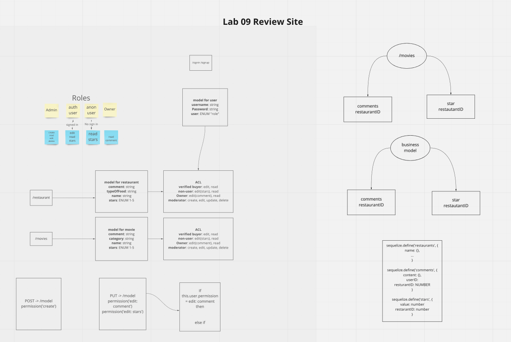

# Auth API BUSINESS REVIEWER  

## Authors

Roop Hayer  
George Mead  
Alex Grazda  

## Summary of Problem Domain

Extend the restrictive capabilities of the routes to API, implementing a fully functional, authenticated and authorized API Server using the latest coding techniques. Routes that end up performing those actions in API/Database need to be protected by both a valid user and that user’s permissions.
## Links to Application Deployment

[Heroku](https://auth-api-business-reviewer.herokuapp.com/)

[Actions Page](https://github.com/BusinessReviewLab09/auth-api-business-reviewer)

[PR](https://github.com/BusinessReviewLab09/auth-api-business-reviewer/pulls)

## Include Embedded UML

## Routes

  - Path: /signin /signup / business / comments / stars

Used collection for the following and 2 different paths: 
 
 `/routes/v2.js` with bearer authentication and ACL